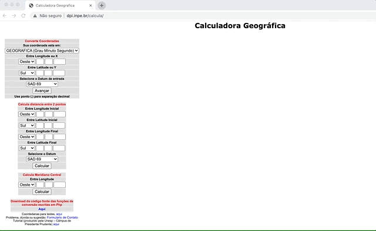
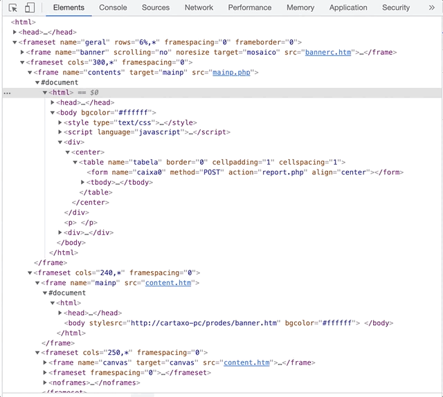
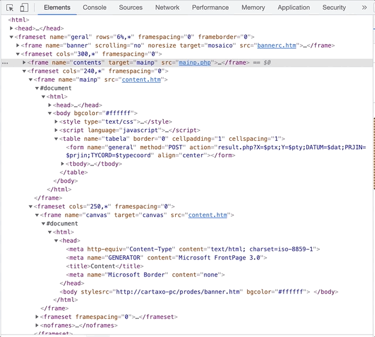

```{r setup, include=FALSE}
knitr::opts_chunk$set(echo = FALSE, code_folding = FALSE)
```

# Motivação

Há algumas semanas uma das pessoas com quem trabalho trouxe a necessidade de fazer uma conversão de coordenadas, a fim de que pudéssemos seguir com algumas análises que estávamos fazendo. Essa tarefa parecia ser coisa simples, pois deveríamos apenas passar as coordenadas da projeção^[É a forma pela qual a superfície de uma esfera é achatada em um plano de forma a criar um mapa, envolvendo uma série de transformações para que a latitude e longitude de cada ponto seja equivalente entre os dois.] de grau-minuto-segundo no datum^[É o sistema de referência utilizado para medir precisamente as distâncias no planeta ou qualquer outra entidade planetária.] SAD69 para a projeção de grau decimal no datum SIRGAS2000. Eu sabia que existia uma forma de fazer essas conversões a partir dos metadados disponíveis em um arquivo _shapefile_, tanto através do pacote `sf` no R quanto na _lib_ `geopandas` no Python. Assim, não havia com o que se preocupar...certo?

De uma forma surpreendente, não consegui encontrar um jeito confiável de fazer a conversão das coordenadas nem no R e nem no Python. A primeira tentativa que fiz foi no R, e acabei esbarrando com a falta de suporte ao datum SIRGAS2000: apesar do código EPSG^[Este é um código numérico único para representar cada combinação de datum, sistemas de referência espacial, ellipsoides, transformações de coordenadas e unidades de medida.] para o SIRGAS2000 existir, as funções do `sf` não parecem ter suporte para ela - falhando na conversão logo de cara. Com isso, fiz minha segunda tentativa usando o Python, mas fiquei meio desconfiado do output: na maior parte dos casos, parecia que o `geopandas` fazia a mudança de projeção e datum do arquivo _shapefile_ sem que, no entanto, os valores das coordenadas em si fossem alteradas. Assim, acabamos esbarrando nesse bloqueio para avançar.

Como não eram muitos pontos que deveriam ter as coordenadas convertidas - mais ou menos uns 50 -, surgiu a ideia de usar uma aplicação como QGIS para realizar as conversões. Apesar da ideia ser boa para o momento, ela traria muitos problemas no curto ou médio prazo: (1) precisávamos colocar as informações de latitude e longitude dentro de um `dataframe` geográfico (_i.e._, um `geodataframe` ou um `sf`) e setar o seu datum e projeção, (2) a partir daí precisaríamos salvar o arquivo para o disco para abrir no QGIS, (3) onde precisaríamos executar manualmente muitos passos para converter as coordenadas e exportar um novo _shapefile_ que, (4) finalmente, poderíamos abrir no R/Python para usar. Além disso, em algum momento receberíamos mais um _batch_ de dados, e precisaríamos repetir o procedimento todo de novo. Logo, resolvemos usar essa solução para sair do lugar naquele momento, mas precisávamos de outra estratégia para tornar essa etapa do _pipeline_ de dados mais robusta e reprodutível.

Uma solução que propus para isso foi o uso da [calculadora geográfica do INPE](http://www.dpi.inpe.br/calcula/). Eu já havia usado ela para desenvolver um trabalho que no passado, e sabia que ali teríamos um resultado bastante confiável. Naquela época, eu havia feito a conversão das coordenadas toda de forma manual^[Isso foi há uns 5 anos atrás.], mas achava que seria tranquilo usar as técnicas de _web scrapping_ que aprendi para automar o processo. No fim das contas, não foi! Todavia, acredito que o exercício foi útil para usar o `Selenium` para interagir com uma página dinâmica. Nesse contexto, acabei criando essa automação usando o Python, mas reproduzi os mesmos passos com o R e, neste post, aproveito o `reticulate` para contar sobre a solução usando tanto o Python quanto o R.

# Entendendo o problema

A calculadora geográfica do INPE está disponível através de uma página web, neste [link](http://www.dpi.inpe.br/calcula/). A página tem uma estrutura bastante simples e intuitiva, através da qual podemos fornecer os inputs para três tarefas principais: (1) converter coordenadas (o _box_ de cima), (2) calcular a distância entre dois pontos (o _box_ do meio) e (3) calcular o meridiano central a partir de uma coordenada (o _box_ de baixo). Nosso foco neste post será o _box_ de cima.

A animação abaixo ilustra de que forma funciona a conversão de coordenadas através da página. A sequência de etapas é a seguinte:  

1. O usuário seleciona a projeção de entrada das coordenadas através de um _dropdown_ (_e.g._, grau-minuto-segundo, grau decimal, UTM,...);  
2. O usuário então entra os valores de longitude e latitude nos dois boxes abaixo. Dependendo da projeção de entrada, o usuário ainda pode ser requisitado à definir se as coordenadas são à oeste ou leste do globo e se está no hemisfério sul ou norte (estas duas últimas opções são definidas, também, através de um _dropdown_);  
3. O usuário então seleciona o datum de entrada através de um _dropdown_ (e.g., SAD69, SIRGAS2000, WGS84,...)
4. Quando o usuário clicar em 'Avançar', um novo _box_ vai aparecer à direita. Esse _box_ servirá para especificarmos as características desejadas para a projeção e datum do output;  
5. Uma vez que o usuário selecione a projeção e o datum de saída, e clique em 'Avançar', uma novo _box_ surgirá à direita - agora, com os resultados da conversão. 



Beleza. Como já podemos reparar, parece haver algum tipo de dinamismo na página: conforme vamos preenchendo o formulário e clicando nas coisas, novas opções e _boxes_ vão surgindo. Para ficar mais claro o que está acontecendo, vamos olhar o que acontece com o código HTML da página conforme vamos interagindo com ela. Para isso, vamos conferir a animação abaixo, que demonstra o que acontece depois da primeira vez que clicamos no avançar (_i.e._, etapa 4 na lista anterior). Como podemos ver, o formulário do primeiro _box_ é uma requisição do tipo POST, que poderíamos passar normalmente usando o R ou o Python. Todavia, uma vez que enviamos o formulário preenchido para o site, vemos que o conteúdo do _box_ seguinte é gerado de forma dinâmica - esse é o momento em que àquela tag `frameset` brilha, e o conteúdo em seu interior é populado. Analisando esse conteúdo, podemos ver que ele abre a possibilidade de fazermos uma nova requisição do tipo POST, desta vez para enviar os dados associados ao passo 5 da lista acima. Ou seja, parece que dois POSTs são necessários para obter o resultado, e que eles vão aparecendo na página de forma dinâmica.



Vamos à última etapa do que rola por baixo dos panos no código HTML, olhando a próxima animação abaixo. Novamente, a tag `frameset` brilha uma vez que o formulário do segundo _box_ é enviado, e a seleção é toda recolhida; se a expandirmos de novo, podemos ver que o seu conteúdo mudou um bocado e, agora, temos acesso à tabela com os dados das coordenadas já convertidas. De uma forma ou de outra, parece que esta tabela também é gerada de forma dinâmica a partir das informações passadas nos formulários anteriores. Além disso, não sei se você notou, mas existe uma chamada para um `javascript` em diversas partes do código. Isso acende a luz amarela.



Tendo em vista o funcionamento da página, resolvi tentar primeiro o `R` para fazer as requisições POST e converter as coordenadas. Fui no `httr` e não tive sucesso: nada do que tentei me permitia obter o conteúdo para que eu fizesse o segundo POST. Daí então resolvi tentar o `rvest` e a possibilidade de usar uma sessão para poder passar os dois POSTs. Aqui eu já tive um pouquinho mais de sucesso, mas sem conseguir chegar onde queria: obtive o resultado do primeiro POST e fazer o segundo, mas o resultado foi uma página em branco. Depois ~~dessa frustração~~desse aprendizado, resolvi tentar a _lib_ _requests_ do Python, mas também não tive muito sucesso. Assim, busquei alguma informação na internet sobre como lidar com `iframes` e requisições POST associados à páginas com conteúdo dinâmico gerado em `javascript` e `PHP`. Entretanto, tudo o que encontrei foram recomendações para usar o `Selenium` para a tarefa. Como eu já estava cansado de buscar uma solução mais simples, resolvi então dar o braço a torcer e partir para o `Selenium.` 

# Interagindo com a calculadora geográfica

Eu já havia usado o `Selenium` no Python no passado, e tinha sido bem simples: foi só baixar o driver para o navegador, criar a instância dele e pronto, a navegação e automação estão na mão. No R, entretanto, a coisa é muito mais complexa: a instalação do `RSelenium` não segue os padrões convencionais dos pacotes do R, existe a necessidade de definir algumas coisas através do terminal e, além disso, existe muito pouco material para resolução de problemas sobre o esse pacote online. Eu até cheguei à superar as duas primeiras complexidades, mas esbarrei na última algumas vezes ao longo das minhas tentativas de criar a automação. Por conta disso, resolvi começar o desenvolvimento da solução através do Python, de forma que assim que eu chegasse ao resultado que precisava, traduziria o código para o R.

Com isto em mente, a primeira coisa que precisamos fazer é importar o pacote `reticulate` e apontar o _path_ onde está o arquivo binário do Python na minha máquina.

```{r carrega_reticulate}
library(reticulate)
use_python(python = Sys.which('python'))
```

O segundo passo é carregar as _libs_ e funções que vamos precisar - tanto o próprio `Selenium` quanto àquelas que nos ajudarão a plotar algumas imagens do avanço da automação.

```{python carrega_python_libs}
from selenium import webdriver
from selenium.webdriver.support.ui import Select
from selenium.webdriver.chrome.options import Options
from matplotlib.pyplot import imshow
from PIL import Image
import numpy as np
```

Começamos a automação _per se_ definindo a forma como vamos executar o `Selenium`. Neste post eu defini que o utilizaremos no modo `headless` a fim de que o navegador não seja aberto durante a execução do código. Se você definir esse argumento como `False`, então verá a execução toda através do navegador em tempo real.

```{python opcoes_selenium}
# setando as opcoes para rodar headless
options = Options()
options.headless = True
```

Todas as operações que faremos com o `Selenium` farão uso de uma instância do Chrome. Para tal, você precisa baixar um executável do Chromedriver que seja compatível com o seu navegador Google Chrome (_i.e._, geralmente àquela com a mesma versão do seu navegador) e colocá-lo em algum diretório. Uma vez que você tenha feito isso, basta especificar o _path_ até o executável, e passar a instância com as opções de execução do _driver_ que definimos anteriormente para a função `webdriver.Chrome`. O código abaixo faz isso e, então, imprime uma mensagem para avisar se conseguimos inicializar a sessão do webdriver ou não.

```{python abre_webdriver}
# abrindo o driver do Chrome
driver = webdriver.Chrome(
  executable_path='/Users/Nicholas/Downloads/chromedriver', 
  options = options
  )
  
# printando o status do driver
try:
  if driver.session_id:
    print('Inicialização do driver feita com sucesso!')
except:
  print('Inicialização do driver falhou!')
```

Uma vez que tenhamos a nossa instância do webdriver, podemos usá-la para navegar até a página que queremos. Para isso, basta usarmos o método `.get`, e passar a `url` da calculadora geográfica do INPE. Uma vez que a página começa a ser carregada, aproveito para passar o método `implicitly_wait` de forma a dizer para o webdriver esperar alguns segundos entre as chamadas de todas as funções do webdriver - isso é útil para evitar de ficarmos enviando ações para o navegador sem que os objetos que queiramos interagir tenham sido carregados. Finalmente, aproveito para tirar um _screenshot_ da tela do webdriver, só para ver se estamos no caminho certo.

```{python abre_pagina}
# entrando no site da calculadora geografica do INPE
driver.get(url = 'http://www.dpi.inpe.br/calcula/')
# aguardando o site carregar
driver.implicitly_wait(10)
# salvando imagem da pagina
scr = driver.save_screenshot(filename='images/screenshot_1.png')
# abrindo imagem da pagina
imshow(np.asarray(Image.open('images/screenshot_1.png', 'r')))
```

Tudo parece certo! A próxima coisa que precisaremos fazer é preencher o formulário do primeiro _box_. Para isso, vamos imitar o nosso comportamento através do `Selenium`, fazendo com que:

+ A automação 'olhe' o primeiro _box_, `contents`;  
+ Precisaremos então usar a função `Select` para interagir com o menu _dropdown_ que recebe as informações da projeção de entrada. Essa função recebe como argumento o ID do elemento que contém o menu _dropdown_ - este, por sua vez, pode ser encontrado através de um _xpath_ específico (descrito no pedaço de código abaixo);  
+ Uma vez que tenhamos criado uma instância desse seletor, podemos então passar para ele o método `select_by_value`, especificando a _string_ que representa a projeção dos dados de entrada - essa _string_ pode ser encontrada dentro do código HTML da página. Eu optei por usar um `select_by_value` aqui, mas também seria possível usar um `select_by_visible_text` e passar o texto conforme está escrito no menu _dropdown_ - só não fiz isso por uma questão de escolha mesmo;  
+ Na sequência, buscamos o elemento que contém a caixinha de texto do input da longitude, e enviamos o seu valor;  
+ Repetimos o processo acima, mas agora focando no valor da latitude de entrada;  
+ O passo seguinte é então selecionar o datum de entrada da coordenada. Para isso, precisamos criar novamente uma instância do `Select` e passar o ID do elemento que contém este menu _dropdown_;  
+ Uma vez que também tenhamos essa instância, basta passar para o método `select_by_value` o valor que representa o datum de entrada (novamente, este valor pode ser encontrado dentro do código HTML da página, e usar o `select_by_visible_text` seria uma opção viável);  
+ Finalmente, buscamos o elemento que contém o botão `Avançar` e clicamos nele.  

```{python primeiro_formulario}
# passando para o primeiro frame para preencher 
driver.switch_to.frame(frame_reference = 'contents')
# selecionando a projecao de entrada
seletor_projecao_entrada = Select(driver.find_element(by = 'xpath', value='//body//div//center//table//tbody//tr[3]//select'))
seletor_projecao_entrada.select_by_value(value = 'latlong_gd')
## imputando o valor da longitude
input_X = driver.find_element(by = 'xpath', value='//body//div//center//table//tbody//tr[5]//td//input')
input_X.send_keys('-43.1034')
## imputando o valor da latitude
input_Y = driver.find_element(by = 'xpath', value='//body//div//center//table//tbody//tr[7]//td//input')
input_Y.send_keys('-22.8822')
# selecionando o datum de entrada
seletor_datum_entrada = Select(driver.find_element(by = 'xpath', value='//body//div//center//table//tbody//tr[9]//select'))
seletor_datum_entrada.select_by_value(value = '1')
## clicando no avancar
driver.find_element(by = 'xpath', value='//body//div//center//table//tbody//tr[10]//td').click()
# salvando imagem da pagina
scr = driver.save_screenshot(filename='images/screenshot_2.png')
# abrindo imagem da pagina
imshow(np.asarray(Image.open('images/screenshot_2.png', 'r')))
```

Podemos ver que a automação funcionou até aqui! Como resposta aos inputs anteriores, precisamos agora é especificar as informações para os dados de saída da conversão. Para isso, continuaremos reproduzindo o nosso comportamento:

+ Primeiro, é preciso 'sair' do primeiro _box_ e passar para o segundo _box_: usaremos o método `switch_to.parent_frame` para o primeiro e o método `switch_to.frame` para o segundo. No caso do segundo _box_, é importante resaltar que precisamos passar como argumento o ID do elemento que contém o segundo _box_. Neste caso, este elemento pode ser selecionar através do nome deste box: `mainp`;  
+ Uma vez que tenhamos entrado no segundo _box_, podemos então selecionar a projeção de saída. Fazemos isso da mesma forma que definimos a projeção de entrada: criando uma instância de um `Select`, passando o ID do elemento que contém o menu _dropdown_ e, então, definindo o valor desejado;  
+ Definimos o datum de saída da mesma forma que fizemos com a projeção de saída e todos os outros menus _dropdown_ até agora;  
+ Após selecionar a projeção e o datum de saída, buscamos o botão `Avançar` deste _box_ e clicamos nele.

```{python segundo_formulario}
# passando para o segundo frame
driver.switch_to.parent_frame()
driver.switch_to.frame(frame_reference = driver.find_element_by_name('mainp'))

# selecionando a projecao de saida
seletor_projecao_saida = Select(driver.find_element(by = 'xpath', value='//html//body//table//tbody//tr[2]//select'))
seletor_projecao_saida.select_by_value(value = 'latlong')
# selecionando o datum de saida
seletor_datum_entrada = Select(driver.find_element(by = 'xpath', value='//html//body//table//tbody//tr[4]//td//select'))
seletor_datum_entrada.select_by_value(value = '5')
## clicando no avancar
driver.find_element(by = 'xpath', value='//html//body//table//tbody//tr[5]//td').click()
# salvando imagem da pagina
scr = driver.save_screenshot(filename='images/screenshot_3.png')
# abrindo imagem da pagina
imshow(np.asarray(Image.open('images/screenshot_3.png', 'r')))
```

Pronto! Chegamos onde precisávamos: o último _box_ com a tabelinha contendo as informações das coordenadas já convertidas. Nosso foco a seguir será conseguir pegar o código HTML que contém essa tabela e guardar essa informação em um objeto. A partir daí, vamos passar esse objeto do Python para o R, a fim de fazer com que o _parsear_ fique mais fácil de ser feito. Mas, antes, vamos por partes:

+ Novamente, precisamos sair do segundo _box_ e passar para o _box_ seguinte - este último chamado de `canvas`;  
+ Uma vez que tenhamos entrado neste box, vamos pegar o _xpath_ do elemento que contém toda a informação da tabela;  
+ Por fim, vamos então extrair o primeiro elemento desse objeto que contém a tabela, e pegar o seu código HTML.  

```{python}
# passando para o ultimo frame
driver.switch_to.parent_frame()
driver.switch_to.frame(frame_reference = driver.find_element_by_name('canvas'))
# pegando a tabela
tabela = driver.find_elements(by = 'xpath', value='/html/body')
# pegando o HTML da tabela
html_da_tabela = tabela[0].get_attribute('innerHTML')
# salvando imagem da pagina
scr = driver.save_screenshot(filename='images/screenshot_4.png')
# abrindo imagem da pagina
imshow(np.asarray(Image.open('images/screenshot_4.png', 'r')))
```

Agora que temos o código HTML da tabela, fica fácil _parsear_ os resultados da conversão. Vamos pegar o código HTML que está dentro do objeto do Python, ler ele como um html no R, e transformá-lo em um `dataframe` através da função `html_table` do pacote `rvest`. Depois que isto está feito, basta apenas fazer mais uma arrumação dos dados e a tarefa está concluída!

```{r parser_tabela}
# carregando pacotes
library(dplyr) # para manipulacao de dados
library(tidyr) # para manipular dados tambem
library(purrr) # para manipular listas
library(rvest) # para ajudar a parsear o HTML

# pegando o HTML do ultimo frame a partir do python
output <- py$html_da_tabela |>
  # lendo o html dele
  read_html() |>
  # parseando a tabela
  html_table() |>
  # tirando a tabela de dentro da lista
  pluck(1) |>
  # eliminando o que é lixo
  filter(!X1 %in% c('Resultado', 'Resultado da conversao:', '--'), X2 != '--') |>
  # passando a tabela para o formato largo
  pivot_wider(names_from = X1, values_from = X2) |>
  # tratando o nome das colunas
  janitor::clean_names()
# printando a tabela
rmarkdown::paged_table(x = output)
```

Coordenadas convertidas e direto dentro do código! Como não temos mais nenhuma outra coordenada para converter aqui, podemos voltar para o Python e fechar a sessão do driver.

```{python fecha_driver}
# fecha o driver
driver.close()
```

# Conclusões

Neste post eu tentei mostrar uma solução que propus para resolver um problema pontual: converter um conjunto de coordenadas para o datum SIRGAS2000 de forma reprodutível, uma vez que não encontrei muito suporte para isso no R, e a conversão através do Python me pareceu meio estranha. A implementação da solução é baseada na automação da operação de conversão de coordenadas através do site da calculadora geográfica do INPE, usando o `Selenium`. Assim, toda a conversão ocorre através de um navegador e múltiplas requisições para um servidor, e não através do processamento na sua máquina _per se_. Isto quer dizer que esta solução não é muito escalável se tivermos que converter um grande número de coordenadas, e deve ser usada com moderação.

O desenvolvimento dessa solução veio muito no sentido de automar uma etapa de um _pipeline_ de dados, que não usa um volume tão grande de observações assim. Além disso, essa solução também nasceu da necessidade de resolver uma questão onde não encontramos uma alternativa mais simples e pré-existente. Com isso, essa solução está OK para endereçar problemas que envolvam aqueles mesmos tipos de contextos, mas está longe de ser o melhor caminho caso eles sejam diferentes. Um exemplo disto seria caso a conversão de datum fosse entre SAD69 e WGS84, onde as funções do pacote `sf` do R parecem funcionar bem - além de ser uma alternativa muito mais simples do que a que mostro aqui! E, por sinal, acho que no fim do dia é isso que realmente importa: resolver o problema de forma rápida, simples, objetiva e reprodutível.

Dúvidas, sugestões ou críticas? É só me procurar que a gente conversa!

# Possíveis extensões

Eu usei um misto de R e Python para fins de demonstração neste post. Todavia, você pode encontrar essa automação escrita toda em R neste link [aqui](https://github.com/nacmarino/codex/blob/94448a97396c3b65ce51191837b6b51379559ac5/_posts/2021-12-23-convertendo-coordenadas-atraves-da-calculadora-geografica-do-inpe/scripts/01_scrapper_r.R), e toda em Python neste outro [aqui](https://github.com/nacmarino/codex/blob/94448a97396c3b65ce51191837b6b51379559ac5/_posts/2021-12-23-convertendo-coordenadas-atraves-da-calculadora-geografica-do-inpe/scripts/02_scrapper_python.py). Uma coisa que seria interessante fazer também é criar uma classe no Python, que pudesse ser usada de forma mais reprodutível para fazer essa conversão. Eu nunca havia chegado a construir uma, e acabei tentando fazer isso [aqui](https://github.com/nacmarino/codex/blob/94448a97396c3b65ce51191837b6b51379559ac5/_posts/2021-12-23-convertendo-coordenadas-atraves-da-calculadora-geografica-do-inpe/scripts/03_CalculadoraINPE.py) pela primeira vez. A ideia é que ela fosse útil para converter não só como mostrei aqui, mas também outras que eu julguei serem comuns em aplicações do nosso dia a dia (e.g., UTM para grau decimal). Eu não cheguei a testar essa classe de forma exaustiva, então sugiro cuidado ao usar ela. De forma similar, sei que ela está longe de estar bem escrita - e estou muito aberto à sugestões de como melhorá-la e oportunidades de aprender mais!

Finalmente, uma outra extensão que vejo seria de pegar o código PHP que faz a conversão das coordenadas e portá-lo para R e Python. Esse código está disponível para download no próprio site da calculadora geográfica do INPE, e seria uma alternativa muito viável para escalar essa conversão.
